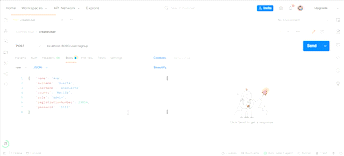

### <div align="center"> **Projeto Final Todas em Tech - { Reprograma }** </div>

<br>

<div align="center">


</div>

<div align="center">

[](https://git.io/typing-svg)

</div>

---

## 📄 Sumário

- [O Projeto](#💻-o-projeto)
    - [Solução](#solução)
- [Funcionalidades](#⚙️-funcionalidades)
- [Arquitetura MVC](#📑-arquitetura-mvc)
- [Rotas](#🛣️-rotas)
    - [Métodos - Usuários](#métodos-postgetputdelete---usuários-user)
    - [Métodos - Postagens](#métodos-postgetputdelete---postagens-post)
- [Regras de Negócio](#📝-regras-de-negócio)
- [Dados para cadastro - Usuários](#🎲-dados-para-cadastro-de-usuários-na-connectour)
- [Dados para cadastro - Postagens](#🎲-dados-para-cadastro-de-atrativos)
- [Documentação da API](#📚-documentação-da-api)
- [Tecnologias Utilizadas](#🛠️-tecnologias-utilizadas)
- [Banco de dados](#🏦-banco-de-dados)
- [Dependências do Projeto](#⚙️-dependências-do-projeto)
- [Dependências do Desenvolvimento](#⚙️-dependências-de-desenvolvimento)
- [Instalação](#👩🏽‍💻-instalação)
- [Testando a API](#🧪-testando-a-api-na-sua-máquina)
- [Implementações Futuras](#🔮-implementações-futuras)
- [Agradecimentos](#💞-agradecimentos)
- [Contatos](#👩🏽‍💻-desenvolvedora)

---

<br>

## 💻 **O Projeto**

<br>

<p align="justify">

A API Connectour, refere-se ao meu projeto final do Bootcamp Backend Todas em Tech [{ reprograma }](https://reprograma.com.br/).

</p>

<p align="justify"> A ideia do projeto surgiu devido a minha longa jornada no setor de Turismo e da minha experiência trabalhando no setor público. </p>

<p align="justify"> Desta vivência, verifiquei que um grande entrave para os funcionários dos Centros de Atendimento ao Turista (CAT) é a comunicação com outros funcionários de outros municípios e o acesso à informações atualizadas e seguras de funcionamento e, as vezes até, da existência de seus atrativos turísticos. Dificuldade esta que prejudica tanto na qualidade do atendimento, quanto na geração de renda para o Estado, pois através da qualidade e precisão das informações que o turista recebe mais tempo ele irá se dispor a permancer no local e/ou voltar para conhecer melhor outras regiões do Estado.

Esta dificuldade de acesso à informações intermunicipais acontece na maioria dos Estados brasileiros. </p>

### _Solução_

<p align="justify"> O projeto consiste em cadastrar informações dos atrativos turísticos pelos funcionários dos centros destinados ao turista de cada município, com intuito de conectá-los, vizando uma maior interação entre eles e, consequentemente, proporcionar melhor atendimento ao seu público (seja ele turista ou moradores da região).</p>

<br>

## ⚙️ **Funcionalidades**
<br>

- [x] Efetuar cadastro das equipes das Secretarias como administradores.
- [x] Efetuar cadastro dos atendentes dos CATs como user.
- [x] Cadastrar as informações dos atrativos turísticos do seu município

<br> 

## 📑 **Arquitetura MVC**
<br>

```
├──📁 CONNECTOUR
    ├──📁 src       
    |   ├─📁 config
    |   |  └─📄mongoConfig.js                
    │   ├─📁controllers            
    │   │  └─📄login.js  
    |   |  └─📄postController.js 
    |   |  └─📄userController.js 
    |   ├─📁middleware                 
    │   │  └─📄auth.js   
    |   |  └─📄roles.js    
    |   ├─📁models                 
    │   │  └─📄postSchema.js   
    |   |  └─📄userSchema.js 
    │   ├─📁routes                 
    │   |  └─📄indexRouter.js    
    |   |  └─📄postRouter.js  
    |   |  └─📄userRouter.js
    |   ├─📁test                 
    │   |  └─📄api.users.test.js 
    |   └─📄app.js 
    ├─📄.env.example
    ├─📄.gitignore
    ├─📄 LICENSE
    ├─📄 Procfile.js      
    ├─📄 README.md
    ├─📄 package-lock.json         
    ├─📄 package.json                 
    └─📄 server.js
   
```
<br>

##  🛣️ ROTAS
<br>

O projeto foi estruturado seguindo modelo da estrura de Arquitetura de Software Rest/Restful, utilizando os protocolos HTTP - POST, GET, PUT, DELETE - CRUD. 

<br>

### Métodos POST/GET/PUT/DELETE - *Usuários* (`user`)
<br>

<div align = "center">

|  Método  |                  Rota                       |                     Descrição                                |
| :------: | :-------------------------------------:     | :-------------------------------------------------------:    |
|  `POST`  | localhost:8090/user/signup                 |    Cadastra novos usuários                  |
|  `POST`  | localhost:8090/user/login                 |    Permite acesso a usuários cadastrados
|  `GET`   | localhost:8090/user/all                    |    Lista de todos os usuários                        |
|  `GET`   | localhost:8090/user/regnumber                 |             Busca usuário por número de registro                                     |
|   `PUT`  |  localhost:8090/user/update/:id        |       Atualizar os dados dos usuários buscando por ID                  |
|  `PUT`  | localhost:8090/order/updatePassword/:id                 |    Atualizar senha do usuário buscando por ID                  |
| `DELETE` |  localhost:8090/user/delete/:id        |                      Deletar registro de usuário buscando por ID          |

</div>
<br>

### Métodos POST/GET/PUT/DELETE - *Postagens* (`post`)
<br>

<div align = "center">

|  Método  |                  Rota                       |                     Descrição                                |
| :------: | :-------------------------------------:     | :-------------------------------------------------------:    |
|  `POST`  | localhost:8090/post/create                 |    Cadastrar atrativos                  |
|  `GET`   | localhost:8090/post/all                    |    Lista de todos posts cadastrados                        |
|  `GET`   | localhost:8090/post/name                 |             Busca por nome do atrativo ou município                                     |
|   `PUT`  |  localhost:8090/post/update/:id        |       Atualizar informações da postagem buscando por ID                  |
| `DELETE` |  localhost:8090/post/delete/:id        |                      Deletar postagem buscando por ID          |

</div>
<br>

## 📝 **Regras de Negócio**
<br>

- [x] Só quem pode cadastrar, editar e deletar usuários são pessoas com acesso de *admin*.
- [x] Não será possível haver mais de um usuário com o mesmo número de registro (*regnumber*).
- [x] Pessoas cadastradas como *user* poderão editar apenas suas senhas.
- [x] Usuários com acesso *user* poderão criar e editar seus próprios *posts* e apenas ver os posts de outros usuários.
- [x] Todos os itens para cadastro de usuário e atrativos são obrigatórios.

<br>

## 🎲 **Dados para cadastro de usuários na ConnecTour**
<br>

```javascript

    name : nome,
    surname : sobrenome,
    userName : nome de usuário
    county : município
    role : tipo de acesso
    registrationNumber : número de registro
    password : senha    

```

## ▶️ Como a API irá retornar

<div align="center">



</div>


</div>
<br>

## 🎲 **Dados para cadastro de atrativos**
<br>

```javascript

    city: cidade,
    attractionName: nome do atrativo,
    opening_hours: horário de funcionamento,
    address: endereço,
    description: descrição

```
<br>

## ▶️ Como a API irá retornar

<div align="center" >


</div>


</div>
<br>

## 📚 Documentação da API

Para ver como resultam as pesquisas efetuadas no Postman, acesse esse link  [Postman](https://documenter.getpostman.com/view/20977005/UzXRRvEB#intro)

<br>

## 🛠️ Tecnologias Utilizadas
<br>

[](https://nodejs.org/en/)
[](https://git-scm.com/)
[](https://docs.npmjs.com/cli/v8/commands/npm-install)
[](https://code.visualstudio.com/)


<br>    

## 🏦 Banco de dados
<br>


	
<br>

## ⚙️ Dependências do Projeto
<br>

- [Express](https://www.npmjs.com/package/express)   
- [Mongoose](https://www.npmjs.com/package/mongoose) 
- [Cors](https://www.npmjs.com/package/cors) 
- [Dotenv-safe](https://www.npmjs.com/package/dotenv-safes) 
- [Bcrypt](https://www.npmjs.com/package/bcryptjs) 
- [Jsonwebtoken](https://www.npmjs.com/package/jsonwebtoken)
- [Supertest](https://www.npmjs.com/package/jest) 
- [Access Control](https://www.npmjs.com/package/accesscontrol) 

<br>

## ⚙️ Dependências de Desenvolvimento
<br>

- [Nodemon](https://www.npmjs.com/package/nodemon)  
- [Jest](https://www.npmjs.com/package/jest) 
- [Supertest](https://www.npmjs.com/package/jest)

<br>

##  👩🏽‍💻 INSTALAÇÃO
<br>

1. Entre na pasta onde você deseja clonar o repositório. Abra o **git** nela e digite: 

    ```bash
    $ git clone https://github.com/elizapimentel/Connectour.git
    ```

2. Digite a linha abaixo para entrar na pasta correta: 

   ```bash
    $ cd Connectour
     ```

3. Escreva a seguinte linha para instalar as dependências utilizadas nesse projeto: 

   ```bash
    $ npm install
    ```
4. Inicie o servidor com o comando: 

   ```bash
    $ npm run dev
    ```   
5. Para realizar a verificação dos testes da API utilize o comando:

    ```bash
    $ npm run test
    ```
<br>

## 🧪 Testando a API na sua máquina
<br>

### Acesse na sua máquina através deste link:
<br>

<a href="https://connectour.herokuapp.com/">
    
</a>

e em seguida copie no  

[](https://www.postman.com/) 

<br>

### Ou siga este passo a passo:
<br>

- Importe a coleção para teste deste servidor clicando [aqui](https://www.getpostman.com/collections/b45300973a371994df34) !

- Copie o link acima e, no [Postman](https://www.postman.com/downloads/), clique em *Import* -> *Link* (cole o link) -> *Continue* -> *Import*.

- Ou fork diretamente para o seu Postman através do link:<div align = "justify"> </div>

<br>

## 🔮 Implementações futuras

- [ ] Modificar algumas autorizações de ações de admin e user;
- [ ] Realizar teste da controller do post;
- [ ] Adicionar impedimento na repetição de senha em sua atualização;
- [ ] Adaptar a API para que possa ser utilizada por outros orgãos;
- [ ] Adicionar segmento de atrativo a ser cadastrado e pesquisa por segmento/descrição

<br>

## ©️ Licença
<br>

### Este projeto está sob a licença [MIT](./LICENSE).

<br>

## 💞 Agradecimentos
<br>

<div align="justify">
<p> Gostaria de agradecer a todas essas mulheres maravilhosas que fazem a Reprograma acontecer e que lutam para que tenhamos uma sociedade mais justa e igualitária. </p>
<p> Agradeço também pelas mulheres que, junto comigo, enfrentaram seus medos e inseguranças e aprenderam o poder da união e também de sermos individuais. #on15forever ❤️ </p>
</dev>
<br>

## 👩🏽‍💻 Desenvolvedora
<br>


Eliza Pimentel ✨

Contatos: <div align = "justify">


[](mailto:elizapimentel@hotmail.com)
[](https://www.linkedin.com/in/eliza-pimentel) 

<br>
<br>
<br>

<div align="center">

 </div>


